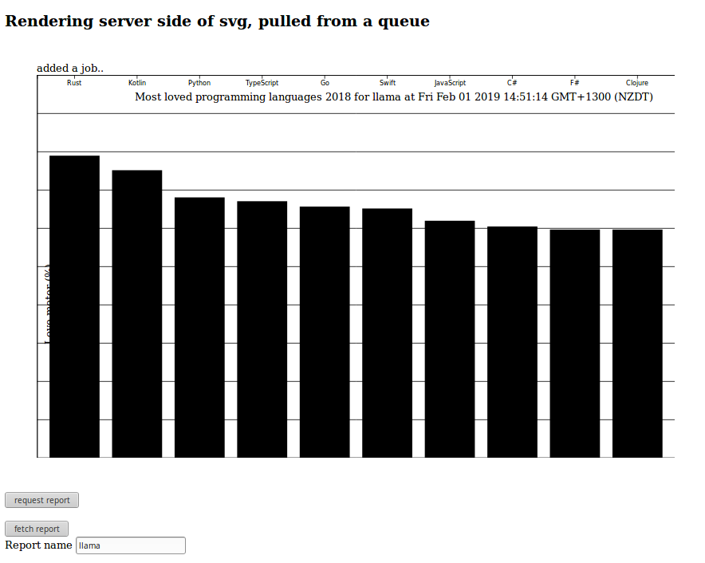

nodejs D3 express redis - Rendering server side of svg, via a queue and redis key pair
===========================

This is a demo showing how to generate SVG in a node express app, using D3. 

## Options

Two options are presented

### SVG generated in an http request directly 

in this example, a web frontend in jquery *cough* will submit a request to the express app to generate and return an SVG to the front end.

### SVG generated by a kue job on the backend after an http request from a web front end

in this example, a web front end again makes a request to the express app to generate an SVG, specified by a name. 

The Express app processes the jobs via the Kue module and places the resulting svg into a redis key, with expiration 10 seconds so it doesn't remain for ever.

A front end ajax call can be triggered after requesting the job and once the SVG is in the named key it will be returned from Redis via the express app. 
This is trivial but should be enhanced for further async processing and scaling, so that the front end can request a generator job and await the result.

## Setup

1. clone the git repository
2. npm install
3. npm install redis kue -g
4. start a redis instance locally:
docker run --name node-redis -p 6379:6379 -d redis:alpine
5. cd myapp
6. npm run dev

## Usage

### Option 1

1. Browse to http://localhost:3000/
2. Click "run"
3. The SVG will be generated on the backend and once received on the front end it will be displayed on the page.

### Option 2

1. Browse to http://localhost:3000/queuedemo
2. Click "request report", which issues a request similar to http://localhost:3000/addjob?name=test43535&dt=1548979134622
3. Click "fetch report", which issues a request similar to http://localhost:3000/getjob?reportname=test43535
3.1 If the job has not run and the report is not in the Redis cache yet it a 404 will be returned with a JSON response {data:'not available'}
3.2 If the job has run and the report is available then the response will return an SVG to the front end, which is displayed on the page.

## Contributors

Quintes van Aswegen, Solution Architect, Ministry of Education New Zealand.

## License

This project is licensed under the terms of the MIT license.
